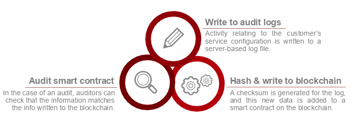

# Tezos Checksum Store

## Goals
IT Managers need to prove the integrity of audit logs, but traditional
audit log storage is vulnerable to untraceable modifications.

## Solution

Write information about log files to the blockchain, creating an
immutable record of information relating to the audit logs.

## How to use

In this Repo you will find tools necessary to achieve the publication of your log checksum on the Tezos blockchain

- audit-contract Is the smart contract that will host your log checksums
- audit-log-cli Is a utility tool to publish your checksum on the blockchain
- audit-client is a simple front end client that will display your checksum from the blockchain storage

# Using the cli

`docker pull carte7000/audit-logs-cli`

Deploy your own instance of the contract
`docker run carte7000/audit-logs-cli deploy`

Add a log entry to the registry
`docker run carte7000/audit-logs-cli add-log -c <address> entity1 test_hash`

Delete an entity from the contract storage
`docker run carte7000/audit-logs-cli delete-entity -c <address> entity1`

Change the owner of the contract (Only the owner can perform action on the contract)
`docker run carte7000/audit-logs-cli set-owner -c <address> entity1 <new_owner>`